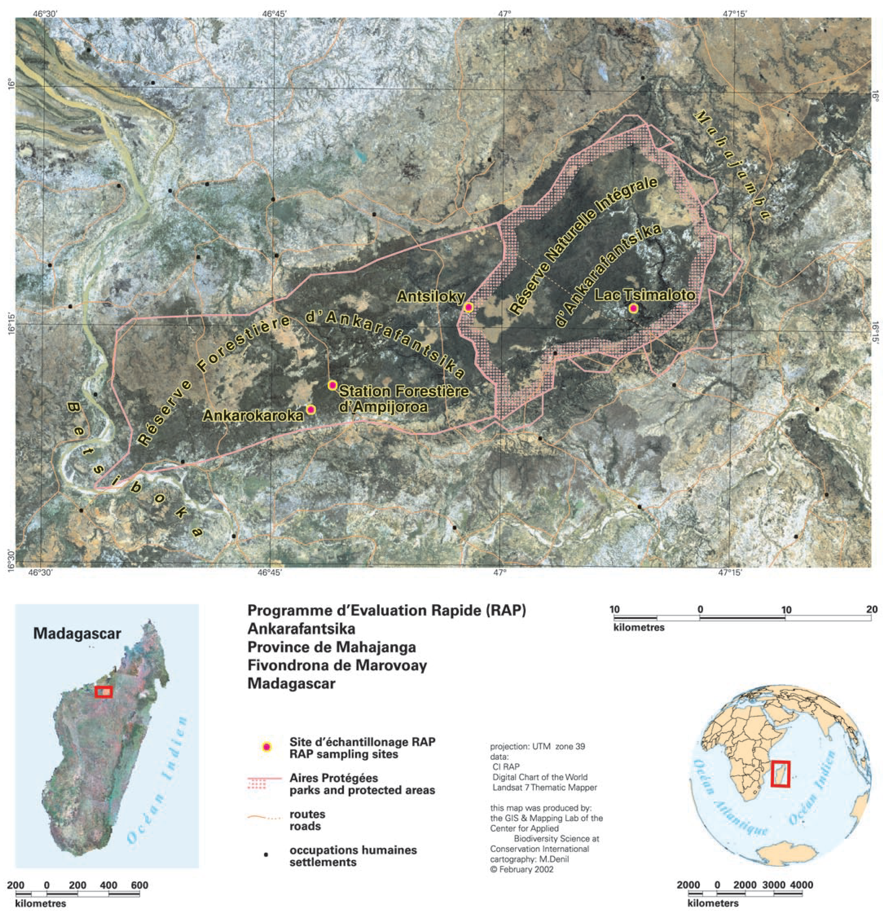

# Marovoay-Ankarafantsika

INTRO 

```{r}
#| label: fig-map-sites
#| fig-cap: "Survey sites and current Ankarafantsika national parks borders"


library(tidyverse)    # A series of packages for data manipulation
library(haven)        # Required for reading STATA files (.dta)
library(labelled)     # To work with labelled data from STATA
library(sf)           # for spatial data handling
library(stringdist)   # for string distance and matching
library(tmap)         # for mapping
library(fuzzyjoin)    # for fuzzy joining
library(readxl)       # Read data frames to Excel format
library(writexl)      # Write data frames to Excel format
library(gt)           # for nicely formatted tables
library(wdpar)
library(panelView)
```


## Protected area expansion

### Ankarafantsika before 2002

L'aire protégée d'Ankarafantsika fait partie des dix Réserves naturelles intégralles (RNI) crées en 1927, pendant la période coloniale. Elle recouvrait alors moins de la moitié de la moitié de sa surface actuelle : 

> Septième réserve naturelle. — Plateau d'Ankarafantsika, situé dans le district de Marovoay, région de Majunga, superficie approximative : 66.541 hectares, ayant pour limites: Au nord, la propriété dite: « Sainte-Marie Marovoay », titre n° 784-M,dts terrains domaniaux et, à une distance de cinq kilomètres environ, les villages d'Ampombomangarakaraka et Beronono ; A l'est, des terrains domaniaux; Au sud, des terrains dumaniaux et, à quelque distance, des villages d'Ankorika et de Bevasaka ;
A l'ouest, des terrains domaniaux et la rivière Mahajamba. Tel au surplus que cette réserve naturelle est figurée à l'un des trois plans annexés audit arrêté.
Décret du 31 décembre 1927

Elle a par la suite évoluée de la manière décrite ci-dessous:

> la Réserve Naturelle Intégrale d’Ankarafantsika fut créée en 1927 et ses limites ont été précisées en 1966 avec le Décret n° 66-242 du 1 juin 1966 (60 520 ha). Parallèlement, des territoires de la Forêt d’Ankarafantsika sur les districts de Marovoay et Ambato Boeny ont été classés réserves forestières avec l’Arrêté du 24 décembre 1929 (75 000 ha). De plus, le Jardin botanique d’Ampijoroa (district d’Ambato Boeny, 91 ha), recensé en 1969 par le Domaine Forestier National est devenu la Station Forestière d’Ampijoroa (4974 ha) en 1999 par l’Arrêté interministériel n° 13-056/99 du 7 décembre 1999. En 2002, la réserve naturelle intégrale créée en 1927 et reclassée en 1966, les réserves forestières instituées en 1929 ainsi que la Station Forestière d’Ampijoroa sont toutes instituées en un seul parc national (Décret n° 2002-798 du 7 août 2002, 130 000 ha). Ce dernier subit un changement de limites en 2015 sous le Décret n° 2015-730 du 21 avril 2015 ; Dernière modification de statut : suivant le Décret n° 2015-730 du 21 avril 2015 ; Surface actuelle : 136 513 ha (selon le décret en vigueur). [@goodman2018, vol. 2, p. 157]"

L'extension de l'aire protégée en 2002 a été cartographée de la manière suivante en 2002, par des experts de l'ONG Conservation internationale qui en avant la charge.


L'objectif de la présente étude est d'évaluer l'impact de l'extension survenue en 2002 sur les populations de villages devenus à cette date limitrophes de la RNI.

Quelques précisions sur le statut de la réserve forestière transformée en RNI lors de l'extension :

> Par arrêté du Gouverneur Général p. i., en date du 24 décembre 1929, pris en conseil d'administration, est mise en réserve, dans les conditions fixées par les articles 50 à 52 du décret du 28 août 1913, la portion du massif forestier dit de l'Ankarafantsika, situé à l'ouest de la 7e réserve naturelle créée par le décret du 31 décembre 1927, dans la province de Marovoay ; La réserve ainsi instituée, d'une surface approximative de 75.000 hectares telle qu'elle est figurée au plan ci-annexé, est limitée: Au nord, par une ligne droite partant de l'angle N. W. de la 7e réserve naturelle et allant jusqu'au village d'Ampombilavakely, puis de ce village jusqu'à la limite de la propriété dite « Croix Rousse » titre n°3153; A l'ouest, par les propriété dites « Croix Rousse et Mont-rouge » titre no 3153 — M. et 2970 — M jusqu'au vilhge de Bongomaro ; Au sud, par la concession n°1059, jusqu'au nord du village de Beilalana, puis; par une ligne droite passant par le village de Bedo et allant jusqu'à l'angle S. W. de la 7e réserve naturelle ; A l'est, par la 7e réserve naturelle.

Les articles 50 à 52 du code forestier de 1913 évoquent le régime aux réserves forestières. Mais on a peu d'éléments sur ce que ça implique en terme de règles.

Cf. Brondeau 1999 sur l'absence de controle dans la réserve forestière à la veille de l'extension de la RNI.

## Survey sites location

The Marovoay rural observatory, performed annual panel household surveys every year from 1995 to 2014, except in 2009 due to the political crisis that rocked the country on that year.

```{r}
observatory_names <- read_xlsx("data/observatory_names.xlsx")

obs_maro <- read_rds("output/correspondence_table4.rds") |> 
  mutate(j0 = as.numeric(j0)) %>%
  left_join(observatory_names, by = c("j0" = "code")) %>%
  rename(OBS_NAME = name) %>%
  relocate(OBS_NAME, .before = j0) %>%
  filter(OBS_NAME == "Marovoay")

obs_maro_communes <- st_read(
  "data/Observatoires_ROS_communes_COD_v3.gpkg",
  quiet = TRUE) %>%
  left_join(select(observatory_names, name, code), 
            by = c("OBS_NAME" = "name")) %>%
  rename(OBS_CODE = code) %>%
  filter(OBS_NAME == "Marovoay")

obs_maro_fokontany <- st_read(
  "data/OCHA_BNGRC admin boundaries/mdg_admbnda_adm4_BNGRC_OCHA_20181031.shp",
  quiet = TRUE) %>%
  filter(ADM3_PCODE %in% obs_maro_communes$ADM3_PCODE & !is.na(OBS_NAME))

ankarafantsika_2025 <- wdpa_read("data/WDPA_WDOECM_Jul2025_Public_MDG.zip") |> 
  filter(NAME == "Ankarafantsika")

st_write(ankarafantsika_2025, "data/ankarafantsika_2025.geojson")

tmap_mode("view")
tm_shape(obs_maro_fokontany %>% 
           filter(ADM4_EN %in% c("Maroala", "Ampijoroa"))) + 
  tm_polygons(fill = "lightblue", col = "darkblue",
              fill.legend = tm_legend_hide()) +
  tm_text(text = "ADM4_EN", fontface = "bold", ymod = 3, xmod = -3) + 
  tm_shape(obs_maro_fokontany %>% 
             filter(ADM4_EN %in% c("Bepako", "Madiromiongana"))) + 
  tm_polygons(fill = "lightgreen", col = "darkgreen",
              fill.legend = tm_legend_hide()) +
  tm_text(text = "ADM4_EN", fontface = "bold", ymod = 3, xmod = -3) + 
  tm_shape(ankarafantsika_2025) +
  tm_borders(col = "darkgreen") +
  tm_fill(fill = "darkgreen", fill_alpha = 0.3) + 
  tm_text(text = "NAME")
  tm_scalebar() +
  tm_basemap("Esri.WorldGrayCanvas")
```

Bien que Maroala et Ampijoara soient proches d'Ankarafantsika à vol d'oiseau, les trajets sont plus rares et couteux. The river Betsiboka is one of the largest in Madagascar. The crossing is possible out of flood or drought period, but it is longer and more coastly, and most boats do it between Maroala and Marovoay (donwstream). 

## Observatory data available

```{r}
#| label: fig-panel-size
#| fig-cap: "Number of household surveyed each year in Marovoay observatory"

library(tidyverse)
library(sf)
library(haven)
library(readxl)
library(labelled)


# Load the locality correspondence table with administrative codes
locality_reference <- readr::read_rds("output/correspondence_table5.rds") %>% 
  select(j0, j42, j4, ADM3_PCODE, ADM3_EN, ADM4_PCODE, ADM4_clean)

# Load observatory names and match them to their codes
observatory_labels <- read_xlsx("data/observatory_names.xlsx") %>%
  mutate(code = as.character(code)) %>%
  select(code, name)

# Function to rename variables using a named list
# e.g. renames = list("j0" = c("obsr", "obsr96"))
rename_all_custom <- function(df, renames) {
  if (length(renames) == 0) return(df)
  for (new_name in names(renames)) {
    # Skip renaming if new_name already exists in df
    if (new_name %in% names(df)) next
    old_names <- renames[[new_name]]
    matched_old <- old_names[old_names %in% names(df)]
    if (length(matched_old) > 0) {
      df <- df %>% rename(!!new_name := all_of(matched_old[1]))
    }
  }
  return(df)
}

# Generic function to load and standardize records from any year
# Arguments:
#   - year: numeric year of the survey
#   - vars: vector of variables to select (after renaming)
#   - renames: named list of renaming rules (new_name = c(possible_old_names))
load_records <- function(year, file_name, vars, renames = list()) {
  path <- paste0("data/ROS_MDG_microdata/", year, "/")
  df <- read_dta(paste0(path, file_name))

  df <- rename_all_custom(df, renames)

  # Ensure all expected vars exist (fill missing with NA)
  missing_vars <- setdiff(vars, names(df))
  df[missing_vars] <- NA

  # Handle j0 if not in original file
  if (!"j0" %in% names(df)) {
    df <- df %>%
      mutate(j0 = substr(j5, 1, 2)) %>% 
      mutate(j0 = as.character(as.numeric(j0)))
  }

  df %>%
    mutate(j0 = as.character(as.numeric(j0))) %>%
    select(any_of(vars))
}

# Define variables to extract from res_deb files
vars_res_deb <- c("year", "j0", "j5", "j4", "j42")
renames_res_deb <- list("j0" = c("obsr", "obsr96"))
# Load res_deb for all years using the same generic function
household_locality_all <- map_dfr(
  1995:2015,
  ~load_records(.x, file_name = "res_deb.dta", vars = vars_res_deb, 
                renames = renames_res_deb)) %>%
  distinct(year, j0, j5, .keep_all = TRUE) %>%
  mutate(across(any_of(c("j0", "j4", "j42", "j5")), as.character))

# Correction des identifiants j5 pour 1995 à l’aide du fichier de 1996
hh_96 <- read_dta("data/ROS_MDG_microdata/1996/res_deb.dta") %>%
  mutate(j0 = as.character(j0)) %>%
  select(j0, year = NULL, j5_96 = j5, j_1995, j12b) %>%
  filter(j_1995 == 1) %>%
  mutate(year = 1995) %>%
  distinct(j0, j12b, .keep_all = TRUE)

household_locality_all <- household_locality_all %>%
  left_join(hh_96, by = c("j0", "year", "j5" = "j12b")) %>%
  mutate(j5 = ifelse(year == 1995 & !is.na(j5_96), j5_96, j5)) %>%
  select(-j5_96)

# Join with geographical references and add observatory names
household_geolocated <- household_locality_all %>%
  left_join(locality_reference, by = c("j0", "j4", "j42")) %>%
  left_join(observatory_labels, by = c("j0" = "code")) %>%
  relocate(name, .after = j0)

# Extract rural observatories and site IDs
household_geolocated <- household_geolocated %>%
  mutate(ro_id = str_sub(j5, 1, 2),
         site_id = str_sub(j5, 1, 3),
         treatment = case_when(
           site_id %in% c("031", "032") & year >= 2003 ~ "Treated (post)",
           site_id %in% c("031", "032") & year < 2003 ~ "Treated (pre)",
           .default = "Control"))

# Aggregate to site-year level with mean values
hh_count_sites <- household_geolocated %>%
  group_by(ro_id, site_id, year, treatment) %>%
  summarise(
    n = n(),
    .groups = "drop"
  ) 

# Plot time trends in income by site, without legend

hh_count_maro <- hh_count_sites |> 
  filter(ro_id == "03") %>%
  mutate(site_name = case_when(
    site_id == "031" ~ "031. Bepako",
    site_id == "032" ~ "032. Madiromiongana",
    site_id == "033" ~ "033. Ampijoroa",
    site_id == "034" ~ "034. Maroala",
    .default = NA_character_
  ))

hh_count_maro |> 
  ggplot(aes(x = year, y = fct_rev(site_name), fill = treatment)) + 
  geom_tile(color = "white") +
  geom_text(aes(label = n), color = "black", size = 3) +
  scale_fill_manual(
    values = c(
      "Treated (pre)" = "lightgreen", 
      "Treated (post)" = "darkgreen", 
      "Control" = "lightblue"
    ),
    name = "Treatment status",
    na.value = "grey"
  ) +
  theme_minimal() +
  labs(x = NULL, y = NULL) +
  theme(legend.position = "bottom", legend.direction = "horizontal")
```

Entre 1995 et 1995, l'observatoire de Marovoay ne comptait que deux sites, ceux situés du même côté de la Betsiboka qu'Ankarafantsika. Ce n'est qu'à partir de 1998 que les deux sites de l'autre côté de la rivière ont été ajoutés.

### Broader control pool
