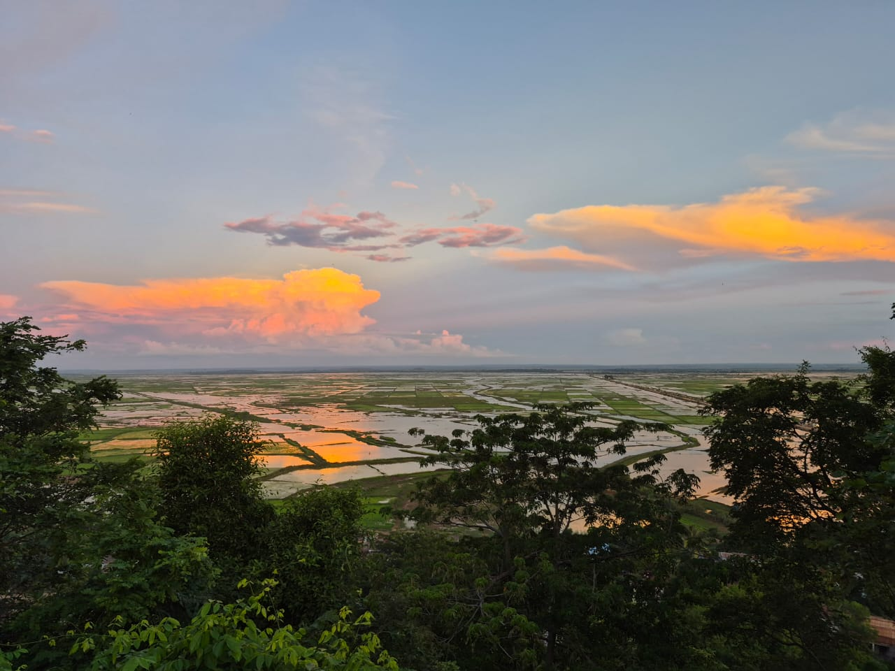

# Overview {.unnumbered}

::: {.callout-note}
## Living document
This website is a companion to an academic paper in preparation. It will be
updated when data from the 2026 survey round becomes available. All code is
available in the [GitHub repository](https://github.com/BETSAKA/Rural_obs_PAs).
:::

{fig-alt="Field photo from the Marovoay observatory site near Ankarafantsika National Park."}

## Abstract

Does the governance model of a protected area matter for the livelihoods of
surrounding communities? We exploit the staggered creation and extension
of protected areas in Madagascar between 2002 and 2008, combined with two
decades of household survey data from the Rural Observatory System (ROS,
1995–2015) and a 2025 resurvey, to estimate the causal impacts of conservation
on household income.

Using generalized synthetic control methods with interactive fixed effects,
a technique that constructs data-driven counterfactuals for each exposed
unit by modelling unobserved common factors, we compare two governance
archetypes: strict conservation (IUCN category II) through the 2002 extension
of Ankarafantsika National Park monitored via the Marovoay observatory, and
multipurpose conservation (IUCN category VI) through the 2008 creation of the
Lac Alaotra new protected area monitored via the Alaotra observatory.
At each site we complement these inter-observatory gsynth estimates with
within-observatory household-level difference-in-differences (DiD) checks —
Callaway–Sant'Anna designs that exploit exposure-intensity contrasts inside
each observatory — providing a second, independent identification robust to
regional confounders.

The generalized synthetic control finds a persistent negative gap in
equivalised household income at the Ankarafantsika east-bank sites
(ATT ≈  log points), while multipurpose conservation at
Alaotra shows no detectable effect (ATT ≈  log points).
However, the within-observatory DiD comparison between east-bank and west-bank
villages finds no equivalent income difference, which suggests
that the externally estimated gap may partly reflect the long-run regional
decline of the Marovoay rice plain — historically Madagascar's primary
irrigated rice zone — rather than a park-specific effect. These results
extend to three additional observatory–PA pairs. A 2025 resurvey confirms
that the east-west income gap at Marovoay persists over the long run, but
its attribution to conservation specifically warrants caution.

## Structure

The analysis chapters present the core argument:

1. [Context](01_context.qmd) — Conservation policy in Madagascar and the
   research question.
2. [Data](02_data.qmd) — The Rural Observatory Surveys, georeferencing,
   and variable construction.
3. [Identification Strategy](03_strategy.qmd) — Exposure definitions,
   donor pool selection, and the generalized synthetic control method.
4. [Results](04_results.qmd) — Comparing strict vs. multipurpose
   conservation impacts on household income.
5. [Extensions](05_extensions.qmd) — Three additional observatories
   near protected areas created during 2006–2007.
6. [Discussion](06_discussion.qmd) — Policy implications, limitations,
   and the roadmap for the 2026 survey wave.

The appendices provide full methodological and data details:

- [A. Data Pipeline](A1_data_pipeline.qmd) — Reproducible georeferencing,
  PA overlap analysis, and variable harmonisation.
- [B. Donor Pool Validity](A2_donor_validity.qmd) — Spatial audit of PA
  exposure across all donor observatories.
- [C. Robustness Tests](A3_robustness.qmd) — Alternative specifications,
  SDID, and sensitivity analysis.
- [D. Methodology](A4_methodology.qmd) — Technical details on gsynth,
  Callaway–Sant'Anna DiD, and interactive fixed effects.
